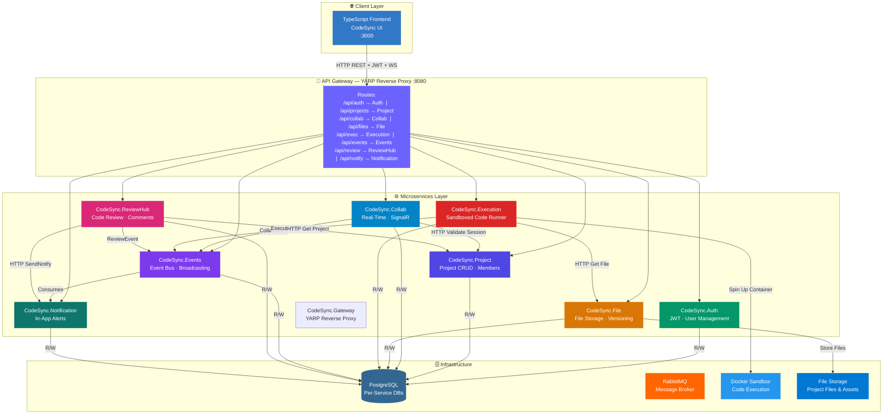
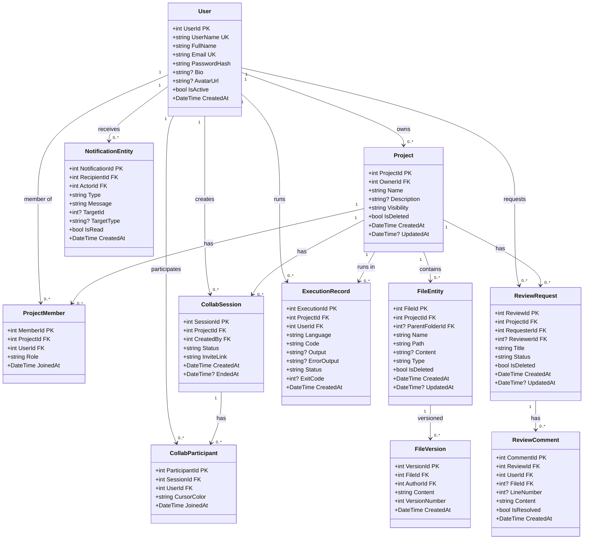
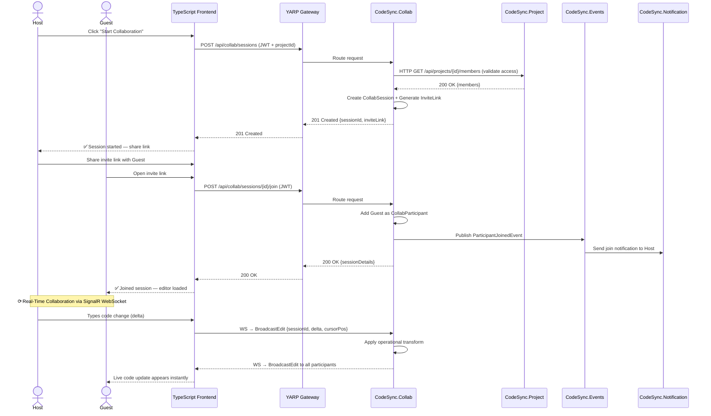
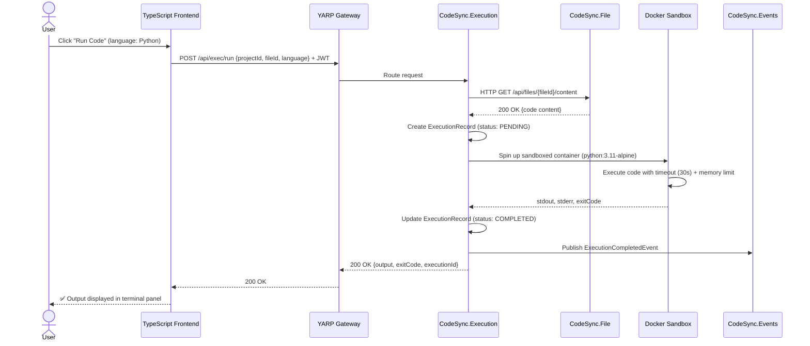
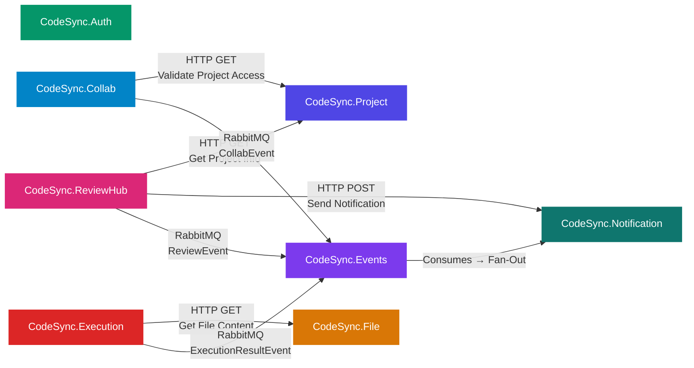

# CodeSync

### A Production-Grade Real-Time Code Collaboration Platform Built on Microservices

[](https://dotnet.microsoft.com/)
[](https://www.typescriptlang.org/)
[](https://www.docker.com/)
[](LICENSE)

CodeSync is a modern, scalable real-time code collaboration platform engineered with a full microservices architecture, event-driven design patterns, and a distributed backend — enabling developers to collaborate on code in real time, manage projects, execute code, review pull requests, and receive instant notifications at scale.

[Architecture](#-system-architecture) · [Microservices](#-microservices-overview) · [API Docs](#-api-reference) · [Setup](#-getting-started)

---

## 📌 Table of Contents

- [Tech Stack](#-tech-stack)
- [Architecture Overview](#-system-architecture)
- [UML Diagrams](#-uml-diagrams)
  - [Use Case Diagram](#1-use-case-diagram)
  - [System Architecture](#2-system-architecture-diagram)
  - [Entity Class Diagram](#3-entity-class-diagram)
  - [Collaboration Session Flow](#4-collaboration-session-flow)
  - [Code Execution Flow](#5-code-execution-flow)
  - [Inter-Service Communication](#6-inter-service-communication-map)
- [Microservices Overview](#-microservices-overview)
- [Core Features](#-core-features)
- [Database Schema](#-database-schema)
- [API Reference](#-api-reference)
- [Infrastructure](#-infrastructure)
- [Design Patterns](#-key-design-patterns)
- [Getting Started](#-getting-started)
- [Project Structure](#-project-structure)
- [Roadmap](#-roadmap)

---

## 🛠 Tech Stack

| Layer | Technology | Purpose |
| --- | --- | --- |
| **Backend** | ASP.NET Core 8 Web API | 9 independent microservices |
| **Frontend** | TypeScript / React | Real-time collaborative code editor UI |
| **Database** | PostgreSQL | Per-service isolated databases (DB-per-service) |
| **ORM** | Entity Framework Core | Code-first migrations & data access |
| **Real-Time** | SignalR / WebSockets | Live cursor sharing, collaborative editing |
| **Message Broker** | RabbitMQ / Event Bus | Async event-driven communication |
| **Code Execution** | Sandboxed Docker Containers | Secure, isolated code runner |
| **Auth** | JWT (HS256) | Stateless authentication |
| **Gateway** | API Gateway (YARP) | Single entry point, routing & JWT validation |
| **Containerization** | Docker & Docker Compose | Full local orchestration |
| **Deployment** | Render.com | Cloud production environment |

---

## 🏗 System Architecture

CodeSync follows a **Microservices Architecture** with these core principles:

| Pattern | Applied Where |
| --- | --- |
| ✅ **Microservices** | 9 independently deployable services |
| ✅ **Event-Driven Architecture** | Async messaging via RabbitMQ |
| ✅ **Real-Time Communication** | SignalR hubs for live collaboration |
| ✅ **API Gateway** | Single YARP entry point for all clients |
| ✅ **Repository + Service Layer** | Clean separation in every microservice |
| ✅ **Sandboxed Execution** | Docker-in-Docker for secure code running |
| ✅ **DB-Per-Service** | Strict data isolation across all 9 services |
| ✅ **DTO Pattern** | Separate request/response models from entities |
| ✅ **Soft Delete** | Data preserved with `IsDeleted` flag |

---

## 📐 UML Diagrams

### 1. Use Case Diagram

> All actors and use cases across every module of CodeSync

```mermaid
graph LR
    GUEST(["👤 Guest"])
    USER(["👤 Registered User"])
    SYSTEM(["⚙️ System\nBackground"])

    subgraph UC["«system» CodeSync — Code Collaboration Platform"]

        subgraph AUTH["🔐 Authentication"]
            UC1["Register Account"]
            UC2["Login / Get JWT"]
            UC3["Logout"]
            UC4["Change Password"]
            UC5["Update Profile"]
            UC6["Deactivate Account"]
        end

        subgraph PROJECT["📁 Project Management"]
            UC7["Create Project"]
            UC8["View Project"]
            UC9["Edit Project"]
            UC10["Delete Project"]
            UC11["Search Projects"]
            UC12["Manage Project Members"]
        end

        subgraph COLLAB["💻 Collaboration"]
            UC13["Create Collaboration Session"]
            UC14["Join Session via Link"]
            UC15["Real-Time Code Editing"]
            UC16["Live Cursor Sharing"]
            UC17["Leave Session"]
            UC18["Manage Session Permissions"]
        end

        subgraph FILES["📂 File Management"]
            UC19["Create File / Folder"]
            UC20["Upload Files"]
            UC21["Edit File"]
            UC22["Delete File"]
            UC23["Download File"]
            UC24["File Version History"]
        end

        subgraph EXECUTION["⚡ Code Execution"]
            UC25["Run Code"]
            UC26["View Execution Output"]
            UC27["View Execution History"]
            UC28["Select Language & Runtime"]
        end

        subgraph REVIEW["🔍 Code Review"]
            UC29["Submit Code for Review"]
            UC30["Review Code / Add Comments"]
            UC31["Approve / Request Changes"]
            UC32["View Review History"]
        end

        subgraph NOTIF["🔔 Notifications"]
            UC33["View All Notifications"]
            UC34["Mark Single as Read"]
            UC35["Mark All as Read"]
            UC36["Delete Notification"]
        end

        subgraph SYS_AUTO["⚙️ System Automation"]
            UC37["Broadcast Collaboration Event"]
            UC38["Publish Execution Result Event"]
            UC39["Send Review Notification"]
            UC40["Send Invite Notification"]
        end

    end

    GUEST --> UC1 & UC2
    USER --> UC3 & UC4 & UC5 & UC6
    USER --> UC7 & UC8 & UC9 & UC10 & UC11 & UC12
    USER --> UC13 & UC14 & UC15 & UC16 & UC17 & UC18
    USER --> UC19 & UC20 & UC21 & UC22 & UC23 & UC24
    USER --> UC25 & UC26 & UC27 & UC28
    USER --> UC29 & UC30 & UC31 & UC32
    USER --> UC33 & UC34 & UC35 & UC36
    SYSTEM --> UC37 & UC38 & UC39 & UC40

    style GUEST fill:#1565C0,color:#fff,stroke:#1565C0
    style USER fill:#2E7D32,color:#fff,stroke:#2E7D32
    style SYSTEM fill:#6A1B9A,color:#fff,stroke:#6A1B9A
```



---

### 2. System Architecture Diagram

> Full deployment view — Client → API Gateway → Microservices → Infrastructure



---

### 3. Entity Class Diagram

> Domain model — all entities, fields, types, and cross-service relationships



---

### 4. Collaboration Session Flow

> Sequence diagram — how a real-time collaboration session works from creation to live editing



---

### 5. Code Execution Flow

> Sequence diagram — secure sandboxed code execution lifecycle



---

### 6. Inter-Service Communication Map

> All synchronous HTTP calls and async event messages between services



**Synchronous (HTTP):**

```
CodeSync.Collab     → CodeSync.Project     (validate project access)
CodeSync.Execution  → CodeSync.File        (fetch file content)
CodeSync.ReviewHub  → CodeSync.Project     (get project info)
CodeSync.ReviewHub  → CodeSync.Notification (send review notification)
```

**Asynchronous (RabbitMQ):**

```
CodeSync.Collab     →  [CollabEvent]            →  CodeSync.Events → Notification
CodeSync.Execution  →  [ExecutionResultEvent]   →  CodeSync.Events → Notification
CodeSync.ReviewHub  →  [ReviewEvent]            →  CodeSync.Events → Notification
```

---

## 📦 Microservices Overview

| Service | Responsibility |
| --- | --- |
| **CodeSync.Auth** | User registration, login, JWT generation, profile management |
| **CodeSync.Project** | Project CRUD, member management, access control, visibility settings |
| **CodeSync.Collab** | Real-time collaborative editing sessions, SignalR hub, cursor sharing |
| **CodeSync.File** | File and folder CRUD, version history, content storage |
| **CodeSync.Execution** | Sandboxed code execution, multi-language runtime, execution history |
| **CodeSync.Events** | Event bus — receives and fans out domain events to subscribers |
| **CodeSync.ReviewHub** | Code review requests, inline comments, approve/reject workflow |
| **CodeSync.Notification** | In-app notifications, unread count, mark-as-read |
| **CodeSync.Gateway** | YARP reverse proxy — routes all incoming client requests, JWT validation |

---

## 🎯 Core Features

**👤 User & Auth**

- Register with username, email, and password
- Login with JWT token
- Profile management — bio, avatar
- Password change & account deactivation (soft delete)

**📁 Project Management**

- Create, edit, and delete projects with Public / Private / Invite-Only visibility
- Invite team members and manage roles (Owner, Editor, Viewer)
- Project search and browse
- Full pagination support

**💻 Real-Time Collaboration**

- Start a collaboration session and share an invite link
- Live multi-user code editing with operational transformation
- Shared cursors with unique color per participant
- Session participant management and permission control

**📂 File Management**

- Create files and folders within projects
- Upload and download files
- Edit file content with autosave
- Full version history — view and restore previous versions

**⚡ Code Execution**

- Execute code directly in the browser across multiple languages
- Sandboxed Docker containers per execution — memory and timeout limits enforced
- View stdout, stderr, and exit codes
- Full execution history per project

**🔍 Code Review**

- Submit files or code changes for review
- Inline commenting with line-number reference
- Approve or request changes workflow
- Review status tracking and history

**🔔 Notifications**

- Real-time alerts for collaboration invites, review requests, review comments, and approvals
- Unread count badge, mark single or all as read, delete notifications

---

## 🗄 Database Schema

Each microservice owns its own isolated PostgreSQL database — no shared DB, no cross-service joins.

| Service | Database | Key Tables | Indices |
| --- | --- | --- | --- |
| **CodeSync.Auth** | `CodeSync_Auth` | `Users` | `UserName` (UK), `Email` (UK) |
| **CodeSync.Project** | `CodeSync_Project` | `Projects`, `ProjectMembers` | `OwnerId + CreatedAt` |
| **CodeSync.Collab** | `CodeSync_Collab` | `CollabSessions`, `CollabParticipants` | `ProjectId + Status` |
| **CodeSync.File** | `CodeSync_File` | `Files`, `FileVersions` | `ProjectId + Path` |
| **CodeSync.Execution** | `CodeSync_Execution` | `ExecutionRecords` | `ProjectId + UserId + CreatedAt` |
| **CodeSync.Events** | `CodeSync_Events` | `DomainEvents` | `EventType + CreatedAt` |
| **CodeSync.ReviewHub** | `CodeSync_ReviewHub` | `ReviewRequests`, `ReviewComments` | `ProjectId + Status` |
| **CodeSync.Notification** | `CodeSync_Notification` | `Notifications` | `RecipientId + IsRead` |

---

## 🌐 API Reference

**🔑 Auth Endpoints — `/api/auth`**

| Method | Endpoint | Auth | Description |
| --- | --- | --- | --- |
| `POST` | `/api/auth/register` | ❌ | Register new user |
| `POST` | `/api/auth/login` | ❌ | Login, returns JWT |
| `GET` | `/api/auth/users/{id}` | ✅ | Get user profile |
| `PUT` | `/api/auth/users/{id}/profile` | ✅ | Update profile |
| `PUT` | `/api/auth/users/{id}/password` | ✅ | Change password |
| `DELETE` | `/api/auth/users/{id}` | ✅ | Deactivate account |

**📁 Project Endpoints — `/api/projects`**

| Method | Endpoint | Auth | Description |
| --- | --- | --- | --- |
| `POST` | `/api/projects` | ✅ | Create project |
| `GET` | `/api/projects/{id}` | ✅ | Get project by ID |
| `GET` | `/api/projects` | ✅ | List user's projects |
| `GET` | `/api/projects/search?q=` | ✅ | Search projects |
| `PUT` | `/api/projects/{id}` | ✅ | Update project |
| `DELETE` | `/api/projects/{id}` | ✅ | Delete project |
| `POST` | `/api/projects/{id}/members` | ✅ | Invite member |
| `DELETE` | `/api/projects/{id}/members/{userId}` | ✅ | Remove member |
| `GET` | `/api/projects/{id}/members` | ✅ | List members |

**💻 Collab Endpoints — `/api/collab`**

| Method | Endpoint | Auth | Description |
| --- | --- | --- | --- |
| `POST` | `/api/collab/sessions` | ✅ | Create session |
| `POST` | `/api/collab/sessions/{id}/join` | ✅ | Join session |
| `DELETE` | `/api/collab/sessions/{id}/leave` | ✅ | Leave session |
| `GET` | `/api/collab/sessions/{id}` | ✅ | Get session details |
| `GET` | `/api/collab/sessions/{id}/participants` | ✅ | List participants |

**📂 File Endpoints — `/api/files`**

| Method | Endpoint | Auth | Description |
| --- | --- | --- | --- |
| `POST` | `/api/files` | ✅ | Create file or folder |
| `GET` | `/api/files/{id}` | ✅ | Get file metadata |
| `GET` | `/api/files/{id}/content` | ✅ | Get file content |
| `PUT` | `/api/files/{id}` | ✅ | Update file content |
| `DELETE` | `/api/files/{id}` | ✅ | Delete file |
| `GET` | `/api/files/{id}/versions` | ✅ | Get version history |
| `GET` | `/api/files/project/{projectId}` | ✅ | Get project file tree |

**⚡ Execution Endpoints — `/api/exec`**

| Method | Endpoint | Auth | Description |
| --- | --- | --- | --- |
| `POST` | `/api/exec/run` | ✅ | Execute code |
| `GET` | `/api/exec/{id}` | ✅ | Get execution result |
| `GET` | `/api/exec/project/{projectId}` | ✅ | Execution history |

**🔍 ReviewHub Endpoints — `/api/review`**

| Method | Endpoint | Auth | Description |
| --- | --- | --- | --- |
| `POST` | `/api/review` | ✅ | Create review request |
| `GET` | `/api/review/{id}` | ✅ | Get review |
| `PUT` | `/api/review/{id}/approve` | ✅ | Approve review |
| `PUT` | `/api/review/{id}/request-changes` | ✅ | Request changes |
| `POST` | `/api/review/{id}/comments` | ✅ | Add inline comment |
| `GET` | `/api/review/{id}/comments` | ✅ | Get comments |
| `PUT` | `/api/review/comments/{id}/resolve` | ✅ | Resolve comment |

**🔔 Notification Endpoints — `/api/notify`**

| Method | Endpoint | Auth | Description |
| --- | --- | --- | --- |
| `GET` | `/api/notify/{userId}` | ✅ | All notifications |
| `GET` | `/api/notify/{userId}/unreadCount` | ✅ | Unread count |
| `PUT` | `/api/notify/{id}/read` | ✅ | Mark as read |
| `PUT` | `/api/notify/{userId}/readAll` | ✅ | Mark all read |
| `DELETE` | `/api/notify/{id}` | ✅ | Delete notification |

---

## 🔧 Infrastructure

### Real-Time Layer — SignalR

- **Hub:** `CollabHub` — handles all live editing events per session
- **Events:** `BroadcastEdit`, `CursorMoved`, `ParticipantJoined`, `ParticipantLeft`
- **Authentication:** JWT validated on connection upgrade
- **Scaling:** Sticky sessions or Redis backplane for multi-instance deployments

### RabbitMQ — Event Bus

- **Publisher services:** `CodeSync.Collab`, `CodeSync.Execution`, `CodeSync.ReviewHub`
- **Consumer:** `CodeSync.Events` fans out to `CodeSync.Notification`
- **Pattern:** Domain events trigger async notification dispatch

### Code Execution — Docker Sandbox

- Each execution spins up a fresh, isolated container
- Supported languages: Python, JavaScript (Node), C#, Java, C++, Go, and more
- Enforced limits: 30-second timeout, 128 MB memory cap, no network access
- Container destroyed immediately after execution completes

### Docker Service Ports

| Service | Container Port | Host Port |
| --- | --- | --- |
| PostgreSQL | 5432 | 5432 |
| RabbitMQ | 5672 | 5672 |
| RabbitMQ Management UI | 15672 | 15672 |
| CodeSync.Auth | 5100 | 5100 |
| CodeSync.Project | 5101 | 5101 |
| CodeSync.Collab | 5102 | 5102 |
| CodeSync.File | 5103 | 5103 |
| CodeSync.Execution | 5104 | 5104 |
| CodeSync.Events | 5105 | 5105 |
| CodeSync.ReviewHub | 5106 | 5106 |
| CodeSync.Notification | 5107 | 5107 |
| CodeSync.Gateway | 8080 | 8080 |
| Frontend (UI) | 3000 | 3000 |

---

## 📊 Key Design Patterns

| Pattern | Applied Where |
| --- | --- |
| Repository + Service Layer | All microservices |
| Dependency Injection | All services via ASP.NET Core DI |
| Operational Transformation | `CodeSync.Collab` — concurrent edit conflict resolution |
| Event-Driven Messaging | RabbitMQ domain events across services |
| Sandboxed Execution | Docker-in-Docker for `CodeSync.Execution` |
| Soft Delete | `Projects`, `Files`, `Users` |
| DTO Pattern | Separate request/response DTOs from entities |
| YARP Reverse Proxy | Gateway routing & JWT validation |
| DB-Per-Service | Strict data isolation, no cross-service joins |

---

## 🔐 Security

- **JWT HS256** — Token signed with shared secret
- **BCrypt** — Password hashing via ASP.NET Identity
- **Claim-based Authorization** — `[Authorize]` on all protected endpoints
- **Sandboxed Execution** — Docker containers with no network, strict resource limits
- **Soft Delete** — User data preserved on account deactivation
- **Input Validation** — DTOs annotated with `[Required]`, `[MaxLength]`
- **EF Core Parameterized Queries** — Full SQL injection protection

---

## 📂 Project Structure

```
Code-Collaboration/
│
├── CodeSync.Auth/
│   ├── Controllers/        AuthController.cs
│   ├── Entities/           User.cs
│   ├── DTOs/               RegisterDto, LoginDto, UserResponseDto
│   ├── Services/           AuthService.cs
│   ├── Repositories/       UserRepository.cs
│   ├── Data/               AuthDbContext.cs
│   └── Program.cs
│
├── CodeSync.Project/
│   ├── Controllers/        ProjectController.cs
│   ├── Entities/           Project.cs, ProjectMember.cs
│   ├── Services/           ProjectService.cs, MemberService.cs
│   └── Program.cs
│
├── CodeSync.Collab/
│   ├── Controllers/        CollabController.cs
│   ├── Hubs/               CollabHub.cs
│   ├── Entities/           CollabSession.cs, CollabParticipant.cs
│   ├── Services/           CollabService.cs, OperationalTransformService.cs
│   ├── HttpClients/        ProjectServiceClient.cs
│   └── Program.cs
│
├── CodeSync.File/
│   ├── Controllers/        FileController.cs
│   ├── Entities/           FileEntity.cs, FileVersion.cs
│   ├── Services/           FileService.cs, VersionService.cs
│   └── Program.cs
│
├── CodeSync.Execution/
│   ├── Controllers/        ExecutionController.cs
│   ├── Entities/           ExecutionRecord.cs
│   ├── Services/           ExecutionService.cs, DockerRunnerService.cs
│   ├── HttpClients/        FileServiceClient.cs
│   └── Program.cs
│
├── CodeSync.Events/
│   ├── Consumers/          CollabEventConsumer.cs, ExecutionEventConsumer.cs
│   ├── Publishers/         EventPublisher.cs
│   └── Program.cs
│
├── CodeSync.ReviewHub/
│   ├── Controllers/        ReviewController.cs
│   ├── Entities/           ReviewRequest.cs, ReviewComment.cs
│   ├── Services/           ReviewService.cs
│   ├── HttpClients/        ProjectServiceClient.cs, NotificationServiceClient.cs
│   └── Program.cs
│
├── CodeSync.Notification/
│   ├── Controllers/        NotificationController.cs
│   ├── Entities/           NotificationEntity.cs
│   ├── Services/           NotificationService.cs
│   └── Program.cs
│
├── CodeSync.Gateway/
│   ├── Program.cs
│   └── appsettings.json    (YARP route configuration)
│
├── frontend/
│   └── codesync-ui/        TypeScript React Frontend
│
├── Dockerfile.combined
├── Dockerfile.execution
├── Dockerfile.notification
├── Dockerfile.reviewhub
├── docker-compose.yml
├── render.yaml
└── CodeSync.slnx
```

---

## 🚀 Getting Started

### Prerequisites

- [.NET 8 SDK](https://dotnet.microsoft.com/download)
- [Docker & Docker Compose](https://www.docker.com/)
- [Node.js 20+](https://nodejs.org/)

### Option 1 — Docker Compose (Recommended)

```bash
# Clone the repository
git clone https://github.com/Kailash8177/Code-Collaboration.git
cd Code-Collaboration

# Start all services (PostgreSQL, RabbitMQ + all API services)
docker-compose up --build

# Gateway available at:
# http://localhost:8080

# Frontend available at:
# http://localhost:3000
```

### Option 2 — Manual Setup

```bash
# Start each service in a separate terminal
dotnet run --project CodeSync.Auth
dotnet run --project CodeSync.Project
dotnet run --project CodeSync.Collab
dotnet run --project CodeSync.File
dotnet run --project CodeSync.Execution
dotnet run --project CodeSync.Events
dotnet run --project CodeSync.ReviewHub
dotnet run --project CodeSync.Notification
dotnet run --project CodeSync.Gateway

# Start the frontend
cd frontend/codesync-ui
npm install
npm run dev
```

### Environment Variables

Each service requires an `appsettings.json` (or environment variables in Docker):

```json
{
  "ConnectionStrings": {
    "Default": "Host=localhost;Port=5432;Database=CodeSync_Auth;Username=postgres;Password=postgres"
  },
  "Jwt": {
    "Key": "YourSuperSecretKey32CharsMinimum!",
    "Issuer": "CodeSync",
    "Audience": "CodeSyncUsers"
  },
  "RabbitMQ": {
    "Host": "localhost",
    "Username": "guest",
    "Password": "guest"
  }
}
```

---

## 🗺 Roadmap

### ✅ Phase 1 — Completed

- User auth, profiles, JWT
- Project management and member roles
- Real-time collaboration sessions with SignalR
- File management with version history
- Sandboxed code execution (multi-language)
- Event-driven notifications via RabbitMQ
- Code review and inline commenting
- Docker Compose orchestration
- Render.com production deployment

### 🔄 Phase 2 — Planned

- [ ] AI-powered code suggestions and auto-completion
- [ ] Git integration (commit, push, pull from within CodeSync)
- [ ] Voice & video chat within collaboration sessions
- [ ] Advanced diff viewer for code reviews
- [ ] Mobile app support

---

## 📚 Resources

- [ASP.NET Core Docs](https://docs.microsoft.com/aspnet/core)
- [SignalR Docs](https://learn.microsoft.com/en-us/aspnet/core/signalr/introduction)
- [YARP Docs](https://microsoft.github.io/reverse-proxy/)
- [RabbitMQ Docs](https://www.rabbitmq.com/documentation.html)
- [Docker Docs](https://docs.docker.com/)

---

Made with ❤️ · CodeSync — Real-Time Code Collaboration Platform
